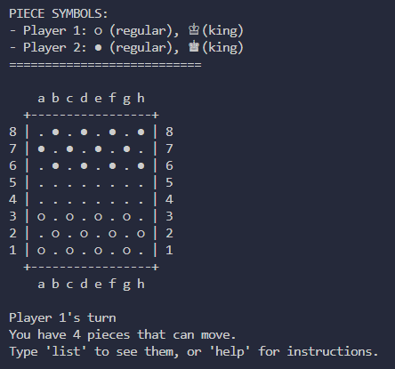
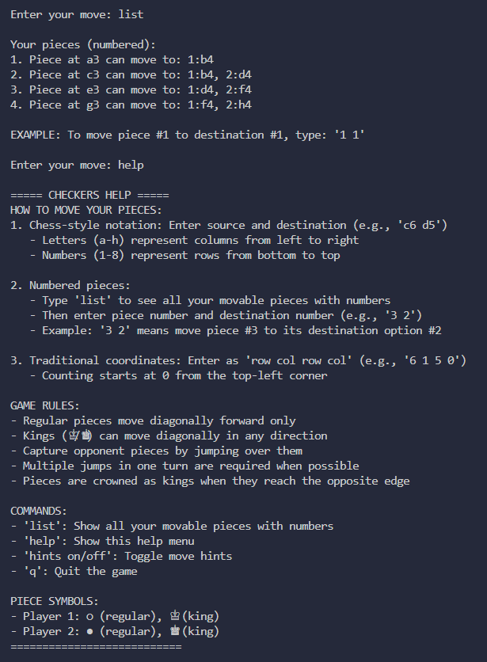
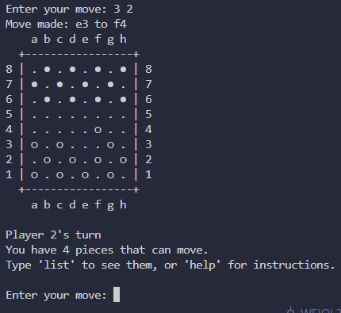

# Python Checkers Game

A feature-rich implementation of the classic Checkers (Draughts) game playable in the terminal.

## Overview

This Python-based Checkers game offers a complete implementation of the traditional board game with an intuitive command-line interface. The game supports standard checkers rules including piece capturing, king promotion, and multiple jumps.

## Features

- **Complete Rules Implementation**: Standard checkers rules including required captures and king movements
- **Multiple Input Methods**:
  - Chess-style notation (e.g., "c6 d5")
  - Numbered piece selection (e.g., "3 2" for piece #3 to its 2nd possible destination)
  - Traditional coordinates (e.g., "6 1 5 0")
- **Visual Board Display**: Clear Unicode-based board representation
- **Interactive Help**: Comprehensive in-game help and instructions
- **Move Hints**: Optional hints showing all possible moves (can be toggled on/off)
- **Game Status Tracking**: Tracks pieces, available moves, and determines game completion

## How to Play

### Setup

1. Ensure you have Python installed on your system
2. Save the `checkers_game.py` file to your preferred location
3. Run the game using:
   ```
   python checkers_game.py
   ```

### Game Controls

The game supports three different ways to move pieces:

1. **Chess Notation**:
   - Enter moves in the format "from to" using chess-style coordinates
   - Example: `c6 d5` (move from c6 to d5)
   - Letters (a-h) represent columns left to right
   - Numbers (1-8) represent rows bottom to top

2. **Numbered Piece Selection**:
   - Type `list` to see all your movable pieces with numbers
   - Enter moves as "piece# destination#"
   - Example: `3 2` (move piece #3 to its destination option #2)

3. **Traditional Coordinates**:
   - Enter as "row col row col" (counting from 0 at top-left)
   - Example: `6 1 5 0` (move from row 6, column 1 to row 5, column 0)

### Additional Commands

- `list`: Display all movable pieces with numbers
- `help`: Show the in-game help menu
- `hints on`/`hints off`: Toggle move suggestions
- `q`: Quit the game

## Game Rules

- Player 1 (○) starts at the bottom of the board
- Player 2 (●) starts at the top of the board
- Pieces move diagonally forward only (kings can move in any direction)
- Captures are made by jumping over opponent pieces
- Multiple jumps in one turn are required when possible
- Pieces are promoted to kings (♔/♚) when they reach the opposite edge
- The game ends when a player cannot move or has no pieces left

## Code Structure

### Main Class
- `CheckersGame`: Main game class handling the entire game logic

### Key Methods
- `__init__()`: Initializes the game board and state
- `display_board()`: Displays the current board state
- `is_valid_move()`: Checks if a move is valid
- `get_possible_moves()`: Gets possible moves for a specific piece
- `get_all_possible_moves()`: Gets all possible moves for current player
- `make_move()`: Executes a move and handles captures
- `play_game()`: Main game loop handling player input

## Screenshots





## Developer Notes

The game implements several helper functions to handle:
- Valid position checking
- Piece type identification
- Move validation
- King promotion logic
- Capture detection and execution
- Game state tracking

The code is designed to be easily extensible if you want to add features like:
- AI opponent
- Game saving/loading
- Network multiplayer
- GUI interface

---

Enjoy playing Checkers!